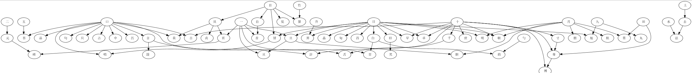

## Kanji-Learning-Algorithm with graphs in Java

---
### Program takes and input of all Kanji characters

Input:  算法設計五目吾冒朋明唱早旦胆白千占卓見元句勺亘旬古昌口世日只言肌的昇百員水貞旧寸竹二十首胃品晶呂舌一博土月田旭朝去頁升専貝九自児丸中頑

### Program organizes and prepares an optimal sequence for learning Kanji characters.

Output:  五目勺口日水竹二十一土月田升九算吾冒朋明早旦白千占卓見元句旬古昌世只言肌昇旧寸胃品晶呂旭朝去貝自丸中法舌設計亘頁専的百唱員児貞首胆博頑

---
### For Example:
<figure>

</figure>

法 is consisted of 去 & 水, and 去 is consisted of 土 & 入 

---
### The algorithm organizes the best learning sequence for the input set of characters. 
### The output is a sequence of characters in increasing order of complexity that build on top of each other.

---
### Output Graph
<figure>

</figure>
